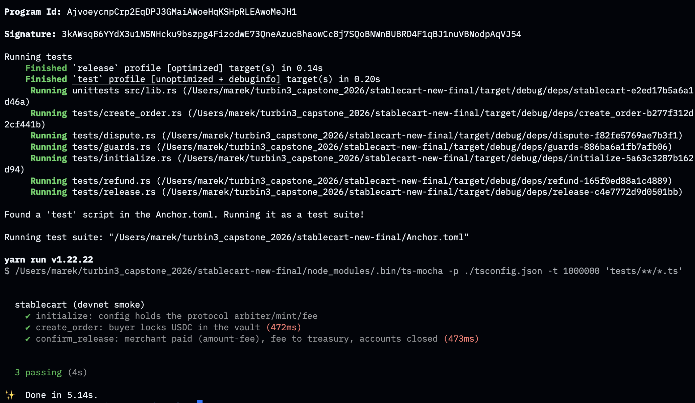

# StableCart v1.0.0

A simple USDC escrow program for Solana built with Anchor. StableCart lets a buyer lock stablecoin funds for a merchant into an on-chain escrow. The funds are only released when the buyer confirms, the deadline passes, the merchant refunds, or an arbiter resolves a dispute. This makes it safe to pay for services without trusting the counterparty up front.


- **Program ID (devnet):** `AjvoeycnpCrp2EqDPJ3GMaiAWoeHqKSHpRLEAwoMeJH1`

## How it works

Every escrow is an `Order` account with its own vault (a token account PDA holding the
locked USDC). The `Config` singleton stores the protocol admin, arbiter, accepted mint,
and the protocol fee.

An order moves through these states:

```
                ┌──────────────► Released
                │
Funded ─────────┼──────────────► Refunded
                │
                └──► Disputed ──► Resolved
```

## Instructions

| Instruction           | Role                     |
|-----------------------|--------------------------|
| `initialize`          | admin                    |
| `create_order`        | buyer                    |
| `confirm_release`     | buyer                    |
| `claim_after_deadline`| merchant                 |
| `refund`              | merchant                 |
| `open_dispute`        | buyer or merchant        |
| `resolve_dispute`     | arbiter                  |

### Key rules

- Only the `allowed_mint` (USDC) is accepted
- Protocol fee is capped at `MAX_FEE_BPS` = 1000 bps (10%)
- Order deadline must be within `MAX_ESCROW_SECONDS` = 90 days
- Amount must be positive and buyer ≠ merchant

## Building & testing

```bash
# Build the program
anchor build

# Fast, exhaustive Rust test suite (LiteSVM, no validator needed)
cargo test

# TypeScript happy-path smoke against a local validator
./scripts/test-local.sh

# TypeScript smoke against devnet
anchor test --provider.cluster devnet --skip-deploy
```


